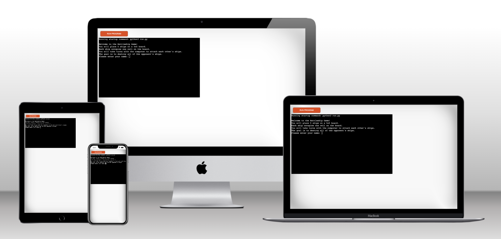
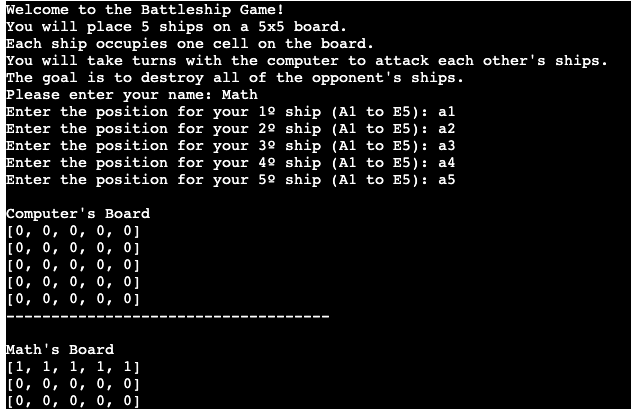
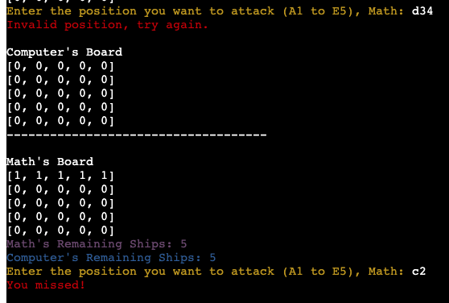
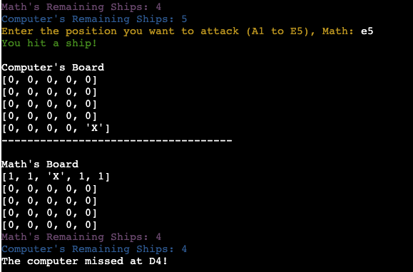
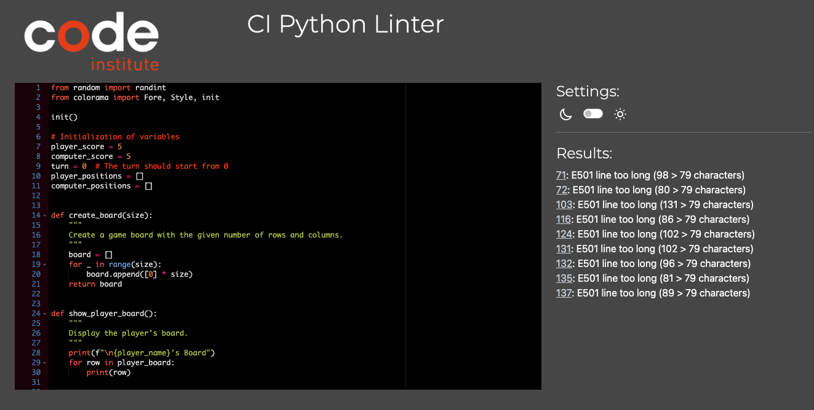
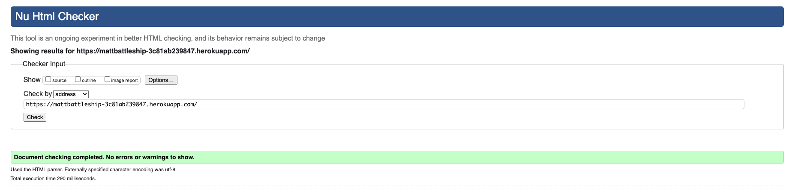

## MattBattleship

Matt Battleship is a Python terminal game, which runs in the Code Institute mock terminal on Heroku

Users can try beat the computer by finding all of the computer's battleships before the computer finds theirs. Each battleship occupies one square on the board.

[View MattBattleship Website](https://mattbattleship-3c81ab239847.herokuapp.com/)

## How to play

Welcome to the Battleship Game! The game is basead on the classic pen-and-paper game. You can read more about in on [Wikipedia](https://en.wikipedia.org/wiki/Battleship_(game)).

- You will place 5 ships on a 5x5 board.
- Each ship occupies one cell on the board.
- You will take turns with the computer to attack each other's ships.
- The goal is to destroy all of the opponent's ships.

## Testing

I have mannually tested this project by doing the following:

- Passed the code trought a PEP8 linter and confirmed there are no problems.
- Given invalid inputs: strings when numbers are expected, out of bounds inputs.
- Tested in my local terminal and the Code Institute Heroku terminal.

## Validator Testing

- PEP8 - No errors were returned from PEP8online.com 

- w3c - No errors were returned from validator.w3.org

---

Happy coding!
